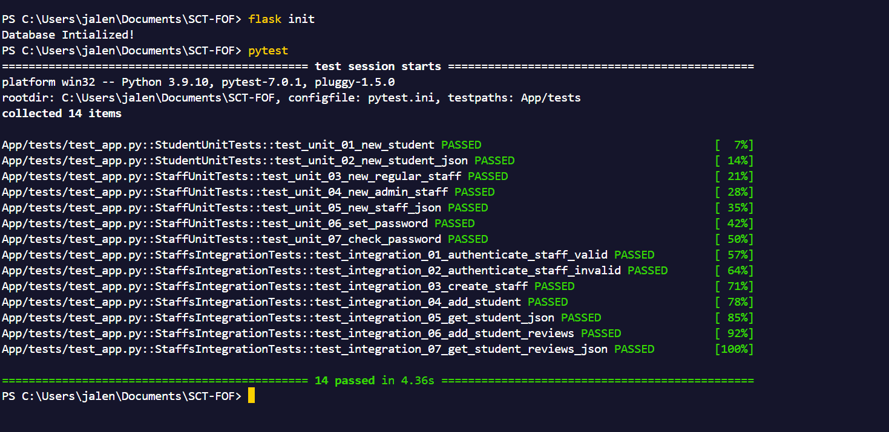

[](https://gitpod.io/#https://github.com/JaleneA/SCT-JaleneA)
[](https://documenter.getpostman.com/view/33150663/2sAXxWYUFw)


# Student Conduct Tracker
Staff System For Recording Positive & Negative Experiences With Students.


## Project Requirements
* Add Student
* Review Student
* Search Student
* View Student Reviews


## Dependencies
* Python3/pip3
* Packages listed in requirements.txt


## Installing Dependencies
```bash
$ pip install -r requirements.txt
```


## Flask MVC
This flask application is structured using the Model View Controller pattern


## Initializing the Database
When connecting the project to a fresh empty database ensure the appropriate configuration is set then file then run the following command.


```bash
$ flask init
```


## Flask Commands
wsgi.py is a utility script for performing various tasks related to the project.


### Admin Commands
```bash
# Creating a Staff Account (inline)
$ flask admin create_staff Mrs. Bubble Bub bubble.bub@staff.com N bubblepass 1
```

```bash
# Creating a Staff Account (interactive input)
$ flask admin create_staff 
```

### Staff Commands
```bash
# Adding a Student Record (inline)
$ flask staff add_student 816031000 Bobby Butterbeard bobby.butterbread@mail.com
```

```bash
# Adding a Student Record (interactive input)
$ flask staff add_student
```

```bash
# Reviewing a Student (inline)
$ flask staff review 816031000 Overall Good Student 1
```

```bash
# Reviewing a Student (interactive input)
$ flask staff review
```

```bash
# Viewing Student Reviews (inline)
$ flask staff view_student_reviews 816031000
```

```bash
# Viewing Student Reviews (interactive input)
$ flask staff view_student_reviews
```

```bash
# Search Student (inline)
$ flask staff search_student 816031000
```

```bash
# Search Student (interactive input)
$ flask staff search_student
```

## Running The Project
For development run the serve command (what you execute):
```bash
$ flask run
```

# Testing

## Unit & Integration
A total of fourteen (14) tests - 7 Unit and 7 Integration are created in the App/test. Located at test_app.py
You can then execute all all application as follows:

```bash
$ pytest
```



or run perform specific tests with the following convention:

```bash
# Run all Student Unit Tests
$ flask test student unit
```

```bash
# Run all Staff Unit Tests
$ flask test staff unit
```

```bash
# Run all Staff Integration Tests
$ flask test staff int
```

# Error Handling
✓ Another Staff With The Same Email Cannot Be Created<br>
✓ Only Admins Can Create Staff Accounts<br>
✓ All Fields Are Required When Creating A New Staff Member<br>
✓ Invalid Student ID Will Not Be Accepted<br>
✓ Cannot Create Another Student With An Already Existing Student ID<br>
✓ All Fields Are Required To Add A Student<br>
✓ Cannot Review a Student That Doesn't Exist<br>
✓ Text And Rating Are Required For Student Reviews<br>
✓ Cannot Search a Student That Doesn't Exist<br>
✓ Cannot Retrieve Reviews for a Student That Doesn't Exist<br>
✓ Invalid Student ID Will Not Be Accepted When Searching or Reviewing Students<br>
✓ General Error Handling For Any Unexpected Issues During Operations (500 Error) <br>
